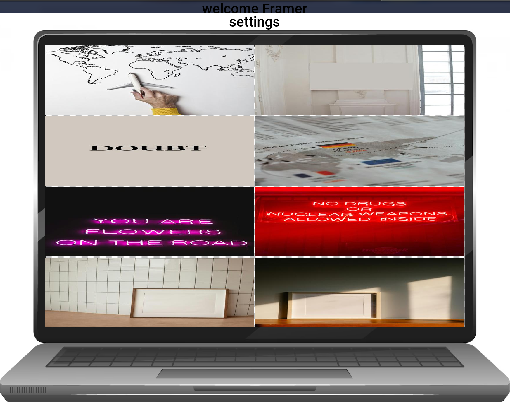
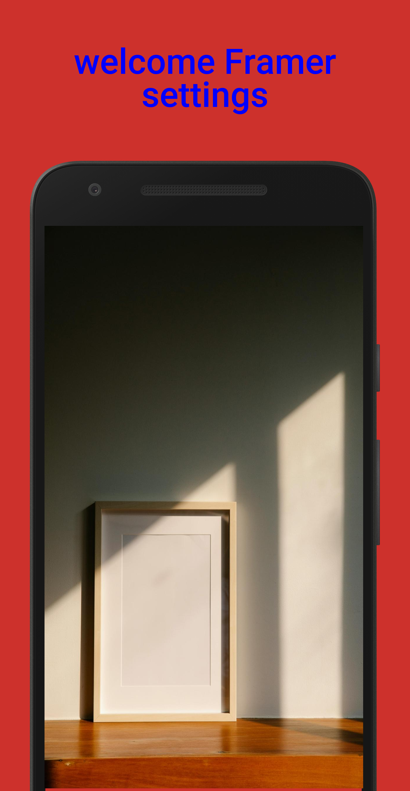

#### Description
This script enhances screenshots by adding frames and customizable text titles. It supports both single-image and multi-image modes, allowing users to frame individual images or batch-framing multiple images.


 laptop Frame  | Single Frame| Multi Frame |
|--------------|-------------|-------------|
|  |  |


#### Features
- **Single Mode:** Frames a single image based on configured parameters.
- **Multi Mode:** Frames multiple images grouped into frames based on specified configurations.
- **Customizable Text Titles:** Configurable titles with options for font, color, and placement.
- **Flexible Configuration:** Separate configuration files for frames, images, and text.

#### Requirements
- Python 3.x
- Packages listed in `requirements.txt`

#### Installation
1. Clone the repository:
   ```bash
   git clone https://github.com/ganeshnikhil/Framer.git
   cd Framer
   ```

2. Set up a virtual environment (recommended):
   ```bash
   python -m venv .venv
   source .venv/bin/activate   # On Windows, use `venv\Scripts\activate`
   ```

3. Install required packages:
   ```bash
   pip install -r requirements.txt
   ```

#### Usage
Run the script with appropriate command-line arguments to frame screenshots.

**Command Line Arguments:**
- `-s`, `--single`: Single image mode.
- `-m`, `--multi`: Multi image mode.
- `-c FILE`, `--config FILE`: Path to configuration file (optional).
- `-t FILE`, `--text FILE`: Path to text configuration file (optional).

**Example Usage:**
```bash
python main.py -s
python main.py -c 
python main.py -s -c path/to/single/config.json -t path/to/text/config.json
python main.py -m -c path/to/multi/config.json -t path/to/text/config.json
```

#### Configuration Files
`Make changes in the configuration according to use.`
**Frame and Image Configuration (`config.json`):**
```json
{
    "Multi": {
        "Frame_width": 1088,
        "Frame_height": 1920,
        "Padding": 10,
        "Intial_x": 152,
        "Intial_y": 771,
        "Images_per_frame": 2,
        "Images_path": "resources/image",
        "Background": "output/framed_image.png",
        "Output_path": "output/framed_image.jpg"
    },
    "Single": {
        "Frame_width": 1088,
        "Frame_height": 1920,
        "Padding": 10,
        "Intial_x": 152,
        "Intial_y": 771,
        "Image_path": "resources/image/1.jpg",
        "Background": "output/framed_image.png",
        "Output_path": "output/framed_image.png"
    }
}
```

**Title Configuration (`title.json`):**
```json
{
    "Frame_width": 1400,
    "Frame_height": 530,
    "Background": "resources/background.png",
    "Font_path": "resources/font.ttf",
    "Output_path": "output/framed_image.png",
    "Title": "Welcome Framer Settings",
    "Color": "blue",
    "Font_size": 120,
    "Split_width": 20
}
```

#### Notes
- Ensure all paths (`Images_path`, `Background`, `Output_path`, etc.) in configuration files are correctly specified relative to the script's execution directory.
- Modify configurations (`config.json`, `title.json`) as per your requirements before running the script.

### requirements.txt

```
# List of required packages
package1==version1
package2==version2
```


Replace `package1`, `version1`, etc., with actual package names and versions required by your script. Users can install these packages automatically using `pip install -r requirements.txt`.


